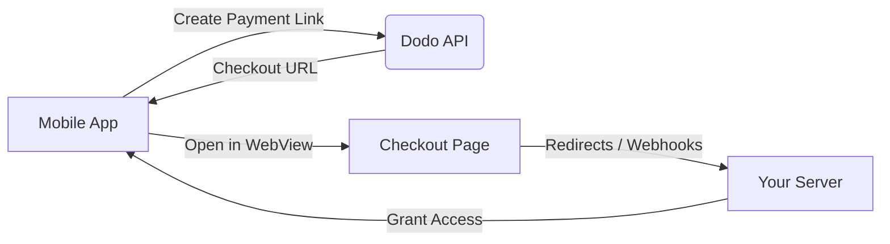

## Introduction

Dodo Payments empowers developers to sell digital goods and services in iOS apps globally, handling complex aspects like tax compliance, currency conversion, and payouts. This comprehensive guide details how to integrate Dodo Payments into your iOS app, specifically for SaaS tools, content subscriptions, and digital utilities.

## 1. Overview
Dodo Payments serves as your **Merchant of Record (MoR)**, managing critical aspects of your digital business:

### What We Handle
- ✅ Tax collection and remittance (VAT, GST, and other regional taxes)
- ✅ Global payments and local payment methods
- ✅ Currency conversion and foreign exchange
- ✅ Chargebacks and fraud prevention
- ✅ End-customer invoicing and receipts
- ✅ Compliance with regional regulations

### What You Get
- 🚀 A unified API for web and mobile platforms
- 💳 Support for in-app checkouts (UPI, cards, wallets, BNPL)
- 🌍 Global payout support (Payoneer, Wise, local bank transfers)
- 📊 Analytics and reporting dashboard
- 🔒 Secure payment processing

---

## 2. Use Cases

### 📱 Subscriptions
- Premium content or feature access
- Recurring billing with flexible options:
  - Free trials
  - Proration
  - Upgrades and downgrades

### 📚 Courses and Learning
- Pay-per-course access
- Bundled content packages
- Lifetime or renewable licenses
- Progress tracking integration

### 🎵 Digital Downloads
- One-time purchases (PDFs, music, tools)
- Digital asset delivery
- License key management

### 🛠️ SaaS Tools
- Software-as-a-Service subscriptions
- Usage-based billing
- Team and enterprise plans

---

## 3. Integration Flow

For a complete developer walkthrough, refer to our [Mobile Integration Guide](api-reference/mobile-integration-guide).

### A. In-App Browser Integration
You can integrate Dodo Payments into your app using our hosted checkout or in-app browser solution.

