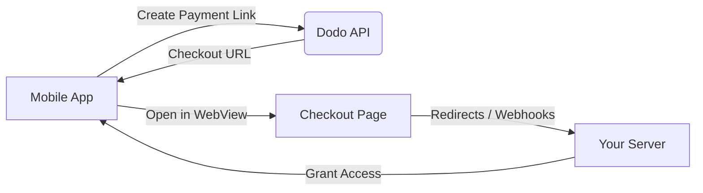

## Introduction

Dodo Payments empowers developers to sell digital goods and services in iOS apps globally, handling complex aspects like tax compliance, currency conversion, and payouts. This comprehensive guide details how to integrate Dodo Payments into your iOS app, specifically for SaaS tools, content subscriptions, and digital utilities.

## 1. Overview
Dodo Payments serves as your **Merchant of Record (MoR)**, managing critical aspects of your digital business:

### What We Handle
- ✅ Tax collection and remittance (VAT, GST, and other regional taxes)
- ✅ Global payments and local payment methods
- ✅ Currency conversion and foreign exchange
- ✅ Chargebacks and fraud prevention
- ✅ End-customer invoicing and receipts
- ✅ Compliance with regional regulations

### What You Get
- 🚀 A unified API for web and mobile platforms
- 💳 Support for in-app checkouts (UPI, cards, wallets, BNPL)
- 🌍 Global payout support (Payoneer, Wise, local bank transfers)
- 📊 Analytics and reporting dashboard
- 🔒 Secure payment processing

---

## 2. Use Cases

### 📱 Subscriptions
- Premium content or feature access
- Recurring billing with flexible options:
  - Free trials
  - Proration
  - Upgrades and downgrades

### 📚 Courses and Learning
- Pay-per-course access
- Bundled content packages
- Lifetime or renewable licenses
- Progress tracking integration

### 🎵 Digital Downloads
- One-time purchases (PDFs, music, tools)
- Digital asset delivery
- License key management

### 🛠️ SaaS Tools
- Software-as-a-Service subscriptions
- Usage-based billing
- Team and enterprise plans

---

## 3. Integration Flow

For a complete developer walkthrough, refer to our [Mobile Integration Guide](api-reference/mobile-integration-guide).

### A. In-App Browser Integration
You can integrate Dodo Payments into your app using our hosted checkout or in-app browser solution.



#### Using WKWebView
```swift
import WebKit

class PaymentViewController: UIViewController, WKNavigationDelegate {
    private var webView: WKWebView!
    
    override func viewDidLoad() {
        super.viewDidLoad()
        
        let webConfiguration = WKWebViewConfiguration()
        webView = WKWebView(frame: view.bounds, configuration: webConfiguration)
        webView.navigationDelegate = self
        view.addSubview(webView)
        
        // Load payment link
        let paymentLink = "https://checkout.dodopayments.com/buy/{productid}"
        if let url = URL(string: paymentLink) {
            let request = URLRequest(url: url)
            webView.load(request)
        }
    }
    
    func webView(_ webView: WKWebView, decidePolicyFor navigationAction: WKNavigationAction, decisionHandler: @escaping (WKNavigationActionPolicy) -> Void) {
        if let url = navigationAction.request.url {
            if url.absoluteString.contains("payment_id") && url.absoluteString.contains("status") {
                // Handle payment completion
                if let components = URLComponents(url: url, resolvingAgainstBaseURL: false) {
                    let paymentId = components.queryItems?.first(where: { $0.name == "payment_id" })?.value
                    let status = components.queryItems?.first(where: { $0.name == "status" })?.value
                    
                    handlePaymentCompletion(paymentId: paymentId, status: status)
                }
                decisionHandler(.cancel)
                return
            }
        }
        decisionHandler(.allow)
    }
    
    private func handlePaymentCompletion(paymentId: String?, status: String?) {
        // Handle payment completion logic
        if status == "succeeded" {
            // Payment successful
        } else {
            // Payment failed
        }
    }
}
```

<Info>Note: Apple Pay integration only works with SFSafariViewController. If you need to support Apple Pay in your iOS app, you must use SFSafariViewController.</Info>

#### Using SFSafariViewController
```swift
import SafariServices

class PaymentViewController: UIViewController, SFSafariViewControllerDelegate {
    private var safariVC: SFSafariViewController?
    
    override func viewDidLoad() {
        super.viewDidLoad()
        
        // Launch payment link
        let paymentLink = "https://checkout.dodopayments.com/buy/{productid}"
        if let url = URL(string: paymentLink) {
            let safariVC = SFSafariViewController(url: url)
            safariVC.delegate = this
            present(safariVC, animated: true)
        }
    }
    
    func safariViewControllerDidFinish(_ controller: SFSafariViewController) {
        // Handle checkout completion
        checkPaymentStatus()
    }
}
```

<Info>Important: SFSafariViewController is required for Apple Pay integration. This is because Apple Pay requires the secure context and authentication capabilities that only SFSafariViewController provides. If your app needs to support Apple Pay payments, you must use SFSafariViewController.</Info>

### B. Handling Apple Pay Redirects in SFSafariViewController

When integrating Apple Pay via SFSafariViewController in iOS, you can automatically detect payment completion without requiring users to manually tap the 'Done' button. This section explains how to implement this using custom URL schemes or Universal Links.

#### Implementation Steps

1. **Configure the Redirect URL**
   When generating the Dodo Payments payment link, set the `redirect_url` to a custom scheme or Universal Link:
   ```swift
   // Custom URL Scheme
   myapp://payment-status?payment_id=xyz&status=succeeded
   
   // Universal Link
   https://myapp.com/payment-status?payment_id=xyz&status=succeeded
   ```

2. **Handle the Redirect in AppDelegate**
   For custom URL schemes, implement this method:
   ```swift
   func application(_ app: UIApplication,
                    open url: URL,
                    options: [UIApplication.OpenURLOptionsKey : Any] = [:]) -> Bool {
   
       if url.scheme == "myapp" && url.host == "payment-status" {
           NotificationCenter.default.post(name: .paymentCompleted, object: url)
           return true
       }
       return false
   }
   ```

3. **Add Notification Observer in View Controller**
   ```swift
   NotificationCenter.default.addObserver(self,
                                        selector: #selector(handlePaymentCompletion(_:)),
                                        name: .paymentCompleted,
                                        object: nil)
   
   @objc func handlePaymentCompletion(_ notification: Notification) {
       if let url = notification.object as? URL {
           safariVC?.dismiss(animated: true)
           // Parse and handle the payment status here
       }
   }
   ```

<Info>Note: Make sure to register your custom URL scheme in your app's Info.plist file under URL Types.</Info>

### C. Creating Payment Links

You can create payment links either statically or dynamically:

#### 1. Static Payment Links
Simple to create by appending your product ID to the base URL:
```
https://checkout.dodopayments.com/buy/{productid}?quantity=1&redirect_url={your website return_url}
```

#### 2. Dynamic Payment Links
Created via API call with customer details:

```swift
// Create a payment link using the Dodo Payments API
func createPaymentLink() async throws -> String {
    let url = URL(string: "https://api.dodopayments.com/v1/payments")!
    var request = URLRequest(url: url)
    request.httpMethod = "POST"
    request.setValue("Bearer \(DODO_SECRET_KEY)", forHTTPHeaderField: "Authorization")
    request.setValue("application/json", forHTTPHeaderField: "Content-Type")
    
    let paymentData: [String: Any] = [
        "payment_link": true,
        "billing": [
            "city": "city",
            "country": "US",
            "state": "state",
            "street": "street",
            "zipcode": 0
        ],
        "customer": [
            "email": "customer@example.com",
            "name": "Customer Name"
        ],
        "product_cart": [
            [
                "product_id": "prod_xyz789",
                "quantity": 1
            ]
        ],
        "return_url": "myapp://payment-status"
    ]
    
    request.httpBody = try JSONSerialization.data(withJSONObject: paymentData)
    
    let (data, _) = try await URLSession.shared.data(for: request)
    let response = try JSONDecoder().decode(PaymentResponse.self, from: data)
    return response.payment_link
}
```

---

## 4. Platform Considerations

### iOS Specific Guidelines
For digital goods sold **outside the App Store**, Dodo Payments enables:
- Web-based checkout via WebView
- Compliance with Apple's reader app guidelines
- Support for cross-platform purchases

#### Permitted Use Cases
- E-learning platforms
- SaaS applications
- Digital content subscriptions
- Utility tools and services

#### Best Practices
- Implement proper receipt validation
- Handle network connectivity issues
- Provide clear purchase flow

### Android Considerations
- Google Play Billing is required for in-app digital goods
- Dodo Payments is ideal for non-in-app purchases (e.g. via browser or emails)

---

## 5. Compliance and Security

Dodo Payments ensures:
- Automatic tax calculation & invoicing per region
- Support for customer refunds and dispute resolution
- Full audit logs for platform compliance (EU, UK, India, etc.)
- PCI DSS compliance
- GDPR and CCPA compliance
- Secure payment processing
- Data encryption at rest and in transit

---

## 6. Example Code

### Create Checkout Session (Node.js)
```js
const response = await fetch("https://api.dodopayments.com/v1/checkout-sessions", {
  method: "POST",
  headers: {
    Authorization: `Bearer ${DODO_SECRET_KEY}`,
    "Content-Type": "application/json",
  },
  body: JSON.stringify({
    customer_id: "cus_abc123",
    product_id: "prod_xyz789",
    success_url: "myapp://payment-status",
    cancel_url: "myapp://payment-cancel",
    metadata: {
      platform: "ios",
      version: "1.0.0"
    }
  }),
});
const session = await response.json();
```

### Handle Webhooks (Node.js)
```js 
import { Webhook } from "standardwebhooks";
import { headers } from "next/headers";

const webhook = new Webhook(process.env.DODO_WEBHOOK_KEY!);

export async function POST(request: Request) {
  const headersList = headers();
  const rawBody = await request.text();

  const webhookHeaders = {
    "webhook-id": headersList.get("webhook-id") || "",
    "webhook-signature": headersList.get("webhook-signature") || "",
    "webhook-timestamp": headersList.get("webhook-timestamp") || "",
  };

  await webhook.verify(rawBody, webhookHeaders);
  const payload = JSON.parse(rawBody);
  
  // Process the payload according to your business logic
}
```

---

## 7. Resources
- 📚 [Dodo API Reference](https://docs.dodopayments.com)
- 📱 [Mobile Integration Guide](https://docs.dodopayments.com/api-reference/mobile-integration-guide)
- 🔔 [Webhooks Setup Guide](https://docs.dodopayments.com/guides/webhooks)
- 💳 [Checkout Session Guide](https://docs.dodopayments.com/guides/checkout)
- 👥 [Customer Portal](https://docs.dodopayments.com/guides/customer-portal)
- 📊 [Analytics Dashboard](https://dashboard.dodopayments.com)

---

## 8. Support and Community
- 💬 [Discord Community](https://discord.gg/bYqAp4ayYh) for real-time help
- 📧 Developer Success Team: dev@dodopayments.com
- 🕒 24/7 Technical Support
